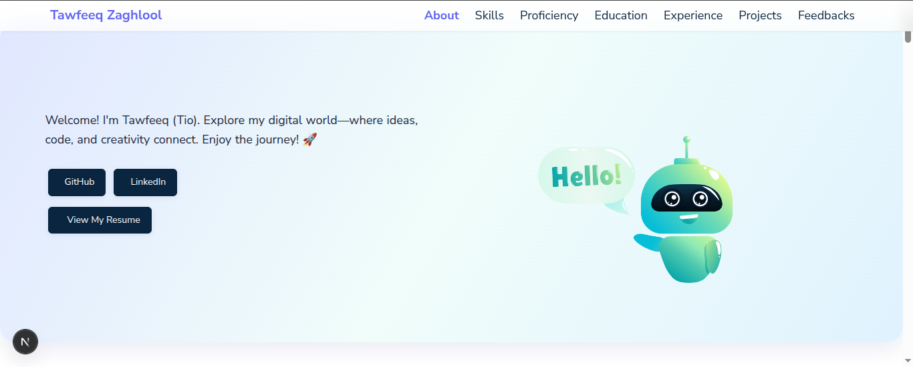

# Tawfeeq Zaghlool's Portfolio Source Code

This portfolio template leverages Next.js, React, and React-DOM, ensuring compatibility with recent versions. (Note: Minimum required versions: Next.js v15.3.4, React ^19, React-DOM ^19)

## Key Features

- Modern and responsive design
- Easy to customize with your own content
- Highlight your skills, projects, and experience

## Sections

- Summary & About Me
- Skills
- Education & Certificates
- Work Experience
- Feedbacks
- Projects
- GitHub Profile

## Getting Started

### Prerequisites

- [Git](https://git-scm.com/downloads)
- [Node.js](https://nodejs.org/en/download) (version compatible with Next.js v14.2.1 - check Next.js documentation for details) with npm or pnpm or yarn installed
- Basic understanding of Git and Node.js is recommended.

**For Windows** Install Visual C++ Build Environment: [Visual Studio Build Tools](https://visualstudio.microsoft.com/thank-you-downloading-visual-studio/?sku=BuildTools)

| Tool    | Version            |
| ------- | ------------------ |
| Node.js | v18.20.1 or higher |
| npm     | v10.5.0 or higher  |
| pnpm    | v8.15.6 or higher  |
| Git     | v2.44.0 or higher  |

## How To Use

### Steps

From your command line, clone and run developer-portolio:

- **Clone this repository**

```bash
git clone https://github.com/tawfeeqzaghlool/my-portfolio
```

- **Navigate to the repository**

```bash
cd my-portfolio
```

- **Install dependencies** (you can use npm or yarn instead of pnpm)

```bash
pnpm install
```

- **Start the development server**

```bash
pnpm dev
```

#### Using Emojis

Emojis can add personality to your portfolio text. Here's how to add static emojis (copy and paste):

1. Visit a website like [Emojipedia](https://emojipedia.org/)
2. Find the emoji you want to use.
3. Copy and paste the emoji directly into your Portfolio.js file.

(Note: This approach works for static emojis. For interactive emoji selection, consider using a library like emoji-picker-react)

## Technologies Used

- [Next.js](https://nextjs.org/)
- React
- React-DOM
- [axios](https://www.npmjs.com/package/axios) (for making API requests)
- UI Library: [daysi ui](https://daisyui.com/)
- [color-thief](https://github.com/lokesh/color-thief)

## Animation Libraries

- react-lottie
- framer-motion

## Illustrations

([Lottie Files](https://lottiefiles.com/))

## Animations

([Framer Motion](https://www.framer.com/motion/))

## Icons

Iconify Icons are used in the skill section. All icons are here: [Iconify](https://icon-sets.iconify.design/).

## Screenshot



## Contact

Feel free to reach out to me at [tawfeeq.zaghlool@gmail.com] or connect with me on social media ([LinkedIn](http://linkedin.com/in/tawfeeqzaghlool))
